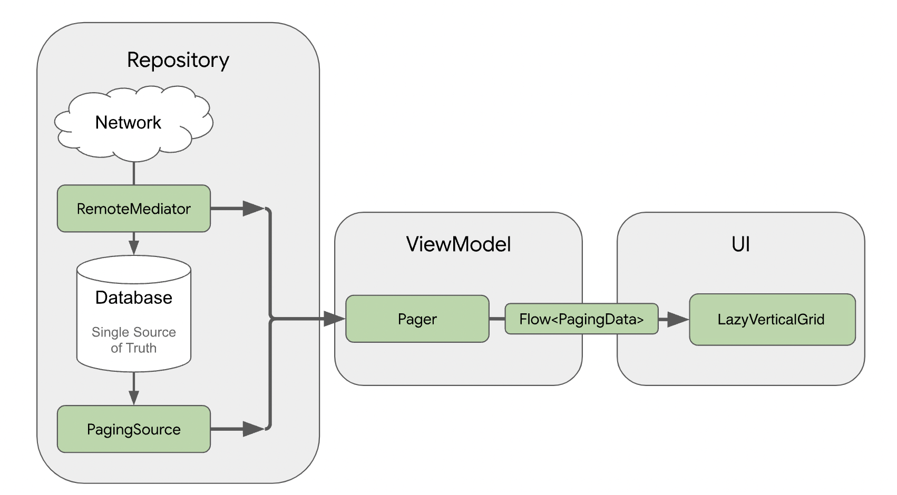

# Cat House
This is a simple Android application which allows users to see cats photos. The application supports data caching and shows cached data while the device is offline.  

# Assignment
The assignment requirements can be found here

The app doesn't reflect much information as the Cataas API doesn't contain much. The following fields mentioned in the assignment do not exist in the API: `owner`, `createdAt`, `updatedAt`. The actual API data is as follows:
```json
{
  "_id": "2lnVocnpd25cUka7",
  "mimetype": "image/jpeg",
  "size": 36161,
  "tags": [
    "cute"
  ]
}
```

# Features
- Dark mode is supported
- Support for different screen sizes added
- Error handling for list refreshing and retry
- Error handling for items appending request failure and retry
- Empty list states
- Image loading failures


# Architecture
The application is built using the Model-View-ViewModel (MVVM) architecture along with Clean Architecture principles. The package structure is designed for easy migration to a multi-module setup.


# Presenter Layer
- The UI consists of 2 screens: list and details using Master/Detail flow The list is fetched page-by-page. When running on tablets the list and detail screens are shown side-by-side.
- The `ViewModel` manages the view state and executes app business logic.

# Domain Layer
- The repositories are presented as interfaces and utilize domain models. This ensures the testability of the application.

# Data Layer
- The repository implementation resides in the data layer, responsible for interacting with the data source and mapping data models into domain models.
- The list of items are retrieved from network through remote mediator ensuring data caching so that the data will be available even if the device goes offline. The list items are loaded page-by-page. 
- Both network and local database data sources use their own models.

# Testing
- An example unit test of Details view model was implemented
- An example UI test of List screen was implemented

# Technologies Used
- Dependency Injection: Koin
- Navigation: Navigation library
- Pagination: Paging Library 3
- Database: Room
- Retrofit2

# TODO
- Add crash reporting tool
- Add more test coverage
- Add analytics (e.g. to track cats of which tags are the most popular)
- Add release build
